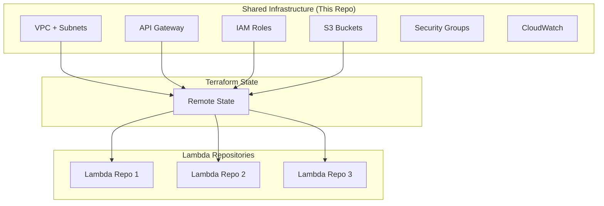

# System Patterns: Shared Infrastructure Architecture

## Architecture Overview

The system follows a "Platform as Code" pattern where shared infrastructure is managed centrally and consumed by distributed Lambda function repositories.



## Key Patterns

### 1. Infrastructure as a Platform

- **Centralized Management**: All shared resources in one repository
- **Distributed Consumption**: Lambda functions reference via remote state
- **Version Control**: Infrastructure changes tracked and reviewed
- **Automated Deployment**: GitHub Actions deploy infrastructure changes

### 2. Resource Sharing Strategy

- **Shared Resources**: VPC, NAT Gateway, API Gateway, S3 buckets
- **Isolated Resources**: Lambda functions, function-specific IAM policies
- **Namespace Strategy**: Use consistent naming conventions across resources

### 3. State Management Pattern

```hcl
# Shared Infrastructure (This Repo)
terraform {
  backend "s3" {
    bucket = "terraform-state-bucket"
    key    = "shared-infra/terraform.tfstate"
    region = "us-east-1"
  }
}

# Lambda Repository Pattern
data "terraform_remote_state" "shared_infra" {
  backend = "s3"
  config = {
    bucket = "terraform-state-bucket"
    key    = "shared-infra/terraform.tfstate"
    region = "us-east-1"
  }
}
```

### 4. Security Patterns

- **Least Privilege**: IAM roles with minimal required permissions
- **Network Isolation**: Private subnets for Lambda functions
- **GitHub OIDC**: No long-lived AWS credentials in GitHub
- **Resource-based Policies**: S3 and API Gateway access controls

### 5. Networking Patterns

- **Private First**: Lambda functions in private subnets by default
- **Shared NAT**: Single NAT Gateway for cost optimization
- **VPC Endpoints**: Reduce NAT Gateway usage for AWS services
- **Security Groups**: Default security group for Lambda functions

### 6. Deployment Patterns

- **Infrastructure First**: Deploy shared infrastructure before Lambda functions
- **Output-Driven**: Well-defined outputs for Lambda consumption
- **Idempotent**: Infrastructure can be re-applied safely
- **Automated**: GitHub Actions handle all deployments

## Resource Naming Conventions

```
{project_name}-{resource_type}-{identifier}

Examples:
- shared-lambda-infra-vpc
- shared-lambda-infra-api-gateway
- shared-lambda-infra-deployment-bucket
- shared-lambda-infra-lambda-execution-role
```

## Integration Patterns

### Lambda Function Integration

1. Reference shared infrastructure via data sources
2. Use shared VPC configuration
3. Leverage shared IAM roles
4. Deploy to shared API Gateway
5. Use shared S3 bucket for artifacts

### API Gateway Integration

1. Create resources under shared API Gateway
2. Use shared authorizers and CORS
3. Follow consistent path naming
4. Leverage shared throttling and caching

## Scalability Considerations

- **Resource Limits**: Monitor VPC resource limits as Lambda functions scale
- **API Gateway Limits**: Plan for request rate limits across all functions
- **S3 Organization**: Use prefixes to organize Lambda artifacts
- **IAM Policy Size**: Monitor policy document size limits
