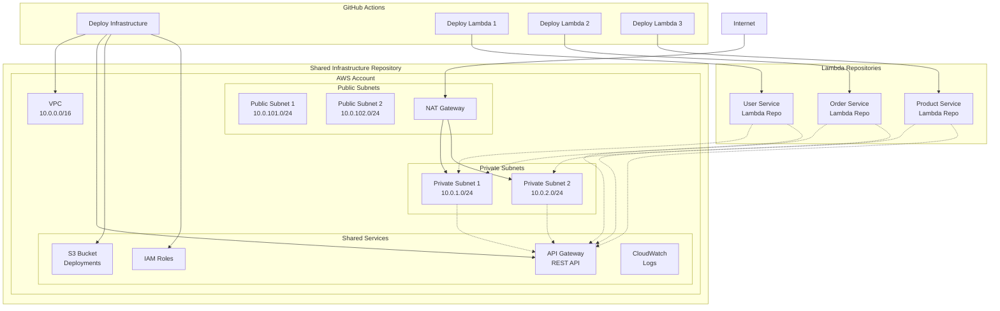
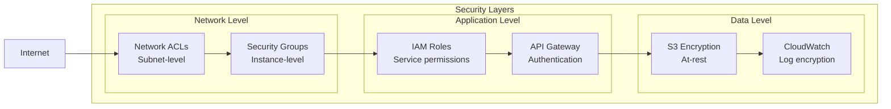
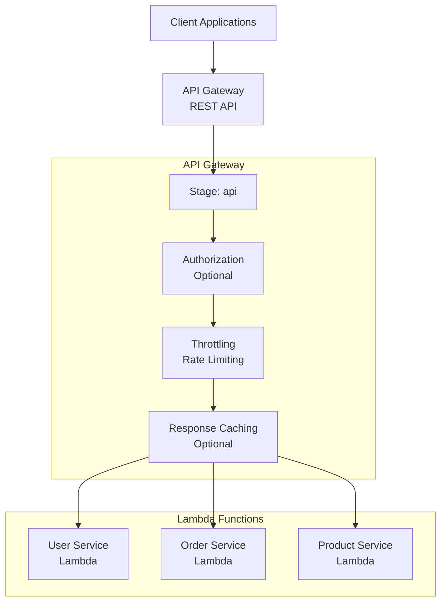
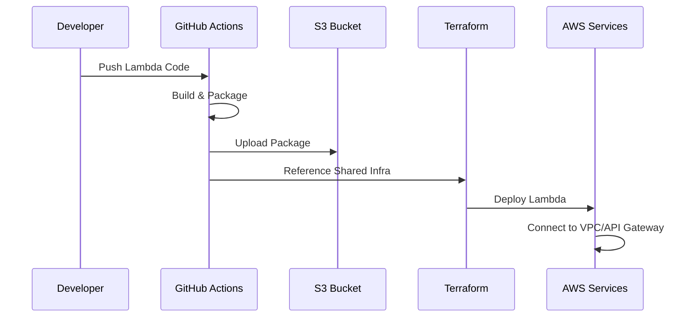
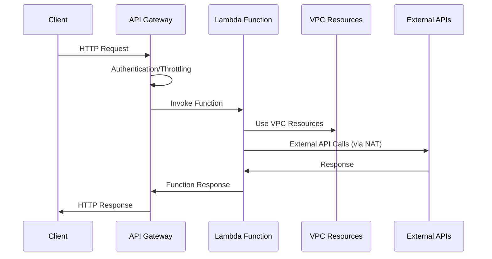
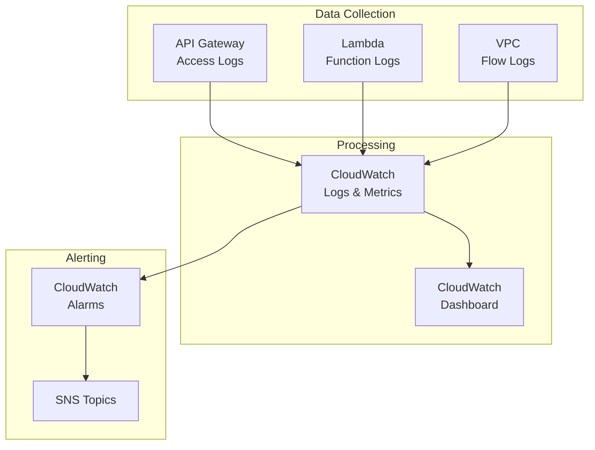

# Architecture Overview

## System Architecture

The shared cloud infrastructure follows a hub-and-spoke model where common AWS resources are centrally managed and consumed by distributed Lambda function repositories.

## Network Architecture

### VPC Design

- **CIDR Block**: 10.0.0.0/16 (65,536 IP addresses)
- **Multi-AZ**: Deployed across 2 availability zones for redundancy
- **DNS**: Enabled for internal service discovery

### Subnet Strategy

| Subnet Type | CIDR          | Purpose                              | Internet Access |
| ----------- | ------------- | ------------------------------------ | --------------- |
| Public 1    | 10.0.101.0/24 | NAT Gateway, future public resources | Direct via IGW  |
| Public 2    | 10.0.102.0/24 | Reserved for scaling                 | Direct via IGW  |
| Private 1   | 10.0.1.0/24   | Lambda functions                     | Via NAT Gateway |
| Private 2   | 10.0.2.0/24   | Lambda functions                     | Via NAT Gateway |

### Routing

- **Public Route Table**: Routes to Internet Gateway for public access
- **Private Route Table**: Routes to NAT Gateway for outbound internet access
- **VPC Endpoints**: Direct access to S3 and DynamoDB (cost optimization)

## Security Architecture

### Network Security

### Security Groups

- **Lambda Security Group**: Outbound only (443, 80) for AWS API calls
- **Default Deny**: No inbound traffic allowed to Lambda functions
- **Least Privilege**: Minimal required permissions

### IAM Strategy

- **Lambda Execution Role**: VPC access + CloudWatch logs
- **GitHub Actions Role**: Deployment permissions only
- **Cross-Service Permissions**: API Gateway → Lambda invoke only

## API Gateway Architecture

### REST API Design

### Resource Structure

- **Base URL**: `https://{api-id}.execute-api.us-east-1.amazonaws.com/api`
- **Resource Pattern**: `/{service}/{action}`
- **Integration**: Lambda Proxy Integration for all functions

## Data Flow Architecture

### Deployment Flow

### Request Flow

## Cost Architecture

### Shared Resources (Cost Savings)

| Resource    | Shared Benefit       | Monthly Cost\*         |
| ----------- | -------------------- | ---------------------- |
| VPC         | All Lambda functions | $0                     |
| NAT Gateway | All outbound traffic | ~$45                   |
| API Gateway | All HTTP endpoints   | $3.50/million requests |
| S3 Bucket   | All deployments      | $0.023/GB              |

\*Estimated costs - actual costs vary by usage

### Per-Lambda Costs

- **Lambda Function**: $0.0000166667/GB-second + $0.20/million requests
- **CloudWatch Logs**: $0.50/GB ingested
- **API Gateway Integration**: Included in shared cost

## Scaling Considerations

### Current Limits

- **Lambda Concurrent Executions**: 1,000 (can be increased)
- **API Gateway Requests**: 10,000/second (can be increased)
- **VPC IP Addresses**: ~65,000 available
- **NAT Gateway Bandwidth**: 45 Gbps

### Scaling Strategy

1. **Horizontal**: Add more Lambda functions using same infrastructure
2. **Vertical**: Increase Lambda memory/timeout per function
3. **Geographic**: Deploy in additional regions as needed
4. **Performance**: Add API Gateway caching and Lambda provisioned concurrency

## Monitoring Architecture

### Observability Stack

### Key Metrics

- **API Gateway**: Request count, latency, error rate
- **Lambda**: Duration, memory usage, error rate, throttles
- **VPC**: Network bytes in/out, NAT Gateway usage
- **Cost**: Monthly spend by service

This architecture provides a robust, scalable, and cost-effective foundation for Lambda-based applications while maintaining security and operational best practices.
